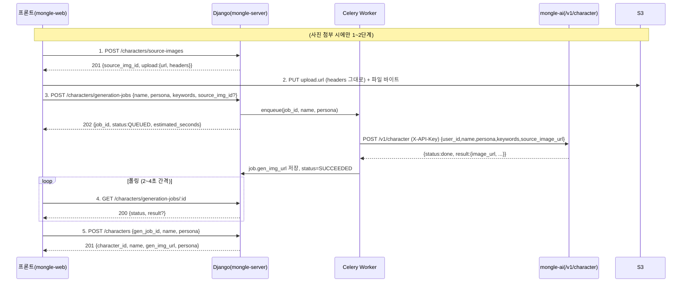

# 캐릭터 생성 API 명세서

> 캐릭터(주민) 생성·등록·조회 전 구간 API 명세. 프론트(mongle-web) ↔ Django(mongle-server) ↔ AI(mongle-ai) 연동 포함.
> 작성: 2026-06-14 · 기준 브랜치: `fix/character-gen-api`

## 1. 개요

캐릭터 생성은 **이미지 생성에 수십 초~수 분**이 걸리므로 **비동기 잡(Job) + 폴링** 구조다. 흐름은 4단계:

1. (사진 있을 때) S3 업로드용 presigned URL 발급 → 프론트가 S3에 직접 업로드
2. 생성 잡 등록 (Celery 큐) → 즉시 `job_id` 반환
3. 잡 상태 폴링 → 완료 시 생성 결과 수신
4. 결과를 확정해 캐릭터 등록

- **인증**: 모든 엔드포인트 JWT Bearer 필요 (`Authorization: Bearer <access_token>`). 미인증/만료 시 공통 `401`.
- **Base URL**: `/api/v1/characters`
- **응답 포맷**: flat JSON (envelope 없음). 에러는 `{"error": "<CODE>"}` (검증 실패는 `{"error": <필드별 메시지>}`)
- **제약**: 활성 캐릭터 최대 **10개**, 하루 이미지 생성 **3회**

## 2. 전체 흐름 (시퀀스)



## 3. 엔드포인트 목록

| #   | 요구사항 ID | Method | Path                                         | 설명                 | 뷰                           |
| --- | ----------- | ------ | -------------------------------------------- | -------------------- | ---------------------------- |
| 1   | CHAR-001    | POST   | `/api/v1/characters/source-images`           | presigned URL 발급   | `SourceImageCreateView`      |
| 2   | CHAR-002    | POST   | `/api/v1/characters/generation-jobs`         | 생성 잡 등록(비동기) | `GenerationJobCreateView`    |
| 3   | CHAR-003    | GET    | `/api/v1/characters/generation-jobs/:job_id` | 잡 상태·결과 조회    | `GenerationJobDetailView`    |
| 4   | CHAR-004    | POST   | `/api/v1/characters`                         | 캐릭터 확정 등록     | `CharacterListView.post`     |
| 5   | CHAR-005    | GET    | `/api/v1/characters`                         | 활성 캐릭터 목록     | `CharacterListView.get`      |
| 6   | —           | GET    | `/api/v1/characters/:character_id`           | 캐릭터 상세          | `CharacterDetailView.get`    |
| 7   | —           | DELETE | `/api/v1/characters/:character_id`           | 캐릭터 삭제(soft)    | `CharacterDetailView.delete` |
| 8   | —           | GET    | `/api/v1/characters/:character_id/quests`    | 퀘스트 목록          | `QuestListView`              |

---

## 4. 엔드포인트 상세

### 4.1. CHAR-001 — presigned URL 발급

`POST /api/v1/characters/source-images`

사진을 첨부하는 경우에만 호출. 발급받은 `upload` 정보로 프론트가 **S3에 직접 PUT** 업로드한다.

**Request Body**

| 필드             | 타입         | 필수 | 설명                          |
| ---------------- | ------------ | ---- | ----------------------------- |
| `file_name`      | string(≤255) | ✅   | 원본 파일명                   |
| `content_type`   | enum         | ✅   | `image/jpeg` 또는 `image/png` |
| `content_length` | int          | ✅   | 1 ~ 5,242,880 (5MB)           |

**비즈니스 로직 (서버 처리 순서)**

1. 입력 검증 (위 표). 위반 시 `400 {"error": <필드 오류>}`.
2. `content_type` → 확장자 매핑 (`image/jpeg`→`jpg`, `image/png`→`png`).
3. `object_key` 생성: `{AWS_S3_PREFIX}/source-images/{user_id}/{uuid}.{ext}` (기본 prefix `mongle-village`). AI 워커와 동일 네임스페이스로 모아 IAM `mongle-village/*` 와 일치시킨다.
4. `SourceImage` 레코드 생성: `status=PENDING_UPLOAD`, `expires_at = now + 600초`.
5. S3 `put_object` presigned URL 발급 — **`ContentType`만 서명에 묶인다**(클라이언트가 같은 `Content-Type`으로 PUT해야 검증 통과). `Content-Length`는 서명하지 않는다(브라우저 금지 헤더).
6. `201` 응답.

**Response `201 Created`**

```json
{
  "source_img_id": "uuid",
  "object_key": "mongle-village/source-images/<user_id>/<uuid>.png",
  "upload": {
    "url": "https://...s3...?X-Amz-Algorithm=...&X-Amz-Signature=...",
    "headers": { "Content-Type": "image/png" }
  },
  "expires_at": "2026-06-14T10:00:00+00:00"
}
```

- ⚠️ `upload.headers`는 **POST 폼 `fields`가 아니라 PUT 요청 헤더**다. 프론트는 S3 PUT 시 `upload.headers`를 **그대로** 실어야 한다(다르면 `403 SignatureDoesNotMatch`).
- `Content-Length`는 서명 헤더에 포함하지 않는다(`SignedHeaders=content-type;host`). 브라우저 Fetch API가 금지 헤더로 취급해 자동 설정하므로, 서명에 넣으면 `403 SignatureDoesNotMatch`가 난다.
- presigned URL 만료: 600초.

**에러**

| 상황                                                                                          | HTTP  | 응답                       |
| --------------------------------------------------------------------------------------------- | ----- | -------------------------- |
| 입력 검증 실패(`content_type`이 jpeg/png 아님, `content_length` 범위 밖, `file_name` 누락 등) | `400` | `{"error": <필드별 오류>}` |
| S3 스토리지 미설정(`AWS_S3_BUCKET` 비어 있음)                                                 | `503` | `{"error": "STORAGE_NOT_CONFIGURED"}` |
| presigned 발급 실패(AWS 자격증명/네트워크)                                                    | `500` | DRF 기본(별도 핸들링 없음) |

> CHAR-001은 다른 엔드포인트와 달리 머신 코드(`*_EXCEEDED`)가 아니라 **DRF 검증 오류 형태**를 반환한다(에러 포맷 표준화는 비범위).

---

### 4.2. CHAR-002 — 생성 잡 등록

`POST /api/v1/characters/generation-jobs`

**Request Body**

| 필드                   | 타입           | 필수 | 설명                                    |
| ---------------------- | -------------- | ---- | --------------------------------------- |
| `name`                 | string(1~8)    | ✅   | 캐릭터 이름                             |
| `persona`              | string         | ✅   | 페르소나 설명                           |
| `personality_keywords` | string[] (1~3) | ✅   | 성격 키워드                             |
| `source_img_id`        | uuid           | ❌   | CHAR-001에서 받은 ID (사진 없으면 생략) |
| `custom_prompt`        | string(≤200)   | ❌   | 외형 묘사 (등록 시 `Character.visual`에 저장) |

**비즈니스 로직 (서버 처리 순서)**

1. 입력 검증. 위반 시 `400`.
2. **활성 캐릭터 수 제한**: `Character(user, is_active=True).count() >= 10` → `422 CHARACTER_LIMIT_EXCEEDED`.
3. **일일 생성 제한**: 오늘 `ImgGenLog(user).count() >= 3` → `429 DAILY_GENERATION_LIMIT_EXCEEDED`.
4. `source_img_id`가 있으면:
   - `SourceImage` 조회(본인 소유). 없으면 `404 SOURCE_IMAGE_NOT_FOUND`.
   - `status==UPLOAD_EXPIRED` 또는 `now > expires_at` → `410 SOURCE_IMAGE_UPLOAD_EXPIRED`.
   - `check_object_exists()`로 실제 S3 업로드 확인 → 있으면 `status=UPLOAD_COMPLETED`.
5. `CharacterGenerationJob` 생성: `status=QUEUED`, `personality_keywords`, `custom_prompt`, `source_image`.
6. `ImgGenLog` 생성(일일 카운트 +1).
7. **Celery 큐 등록**: `process_character_generation_job.delay(job_id, name, persona)`.
   - name·persona는 잡 모델에 저장하지 않고 **태스크 인자로 전달**(마이그레이션 회피).
8. `202` 응답.

**Response `202 Accepted`**

```json
{ "job_id": "uuid", "status": "QUEUED", "estimated_seconds": 60 }
```

**에러**: `CHARACTER_LIMIT_EXCEEDED`(422), `DAILY_GENERATION_LIMIT_EXCEEDED`(429), `SOURCE_IMAGE_NOT_FOUND`(404), `SOURCE_IMAGE_UPLOAD_EXPIRED`(410).

---

### 4.3. CHAR-003 — 잡 상태 조회(폴링)

`GET /api/v1/characters/generation-jobs/:job_id`

**비즈니스 로직**

1. `CharacterGenerationJob` 조회(`job_id`, 본인 소유). 없으면 `404 NOT_FOUND`.
2. 직렬화: `result`는 `status==SUCCEEDED`일 때만 `{gen_img_url, persona}`, 그 외 `null`.
3. `200` 응답. 프론트는 2~4초 간격 폴링.

**Response `200 OK`**

```json
{
  "job_id": "uuid",
  "status": "QUEUED | IN_PROGRESS | SUCCEEDED | FAILED | CONSUMED",
  "result": { "gen_img_url": "https://cdn/...png", "persona": "..." },
  "created_at": "...",
  "updated_at": "..."
}
```

---

### 4.4. CHAR-004 — 캐릭터 확정 등록

`POST /api/v1/characters`

**Request Body**

| 필드         | 타입        | 필수 | 설명         |
| ------------ | ----------- | ---- | ------------ |
| `gen_job_id` | uuid        | ✅   | 성공한 잡 ID |
| `name`       | string(1~8) | ✅   | 캐릭터 이름  |
| `persona`    | string      | ✅   | 페르소나     |

**비즈니스 로직 (서버 처리 순서)**

1. 입력 검증. 위반 시 `400`.
2. **활성 캐릭터 수 제한**: `>= 10` → `422 CHARACTER_LIMIT_EXCEEDED`.
3. `CharacterGenerationJob` 조회(`gen_job_id`, 본인 소유). 없으면 `404 JOB_NOT_FOUND`.
4. `status==CONSUMED` → `409 JOB_ALREADY_CONSUMED` (한 잡은 한 번만 등록 가능).
5. `status!=SUCCEEDED` → `400 JOB_NOT_SUCCEEDED`.
6. `Character` 생성: `generation_job=job`, `character_name=name`, `gen_img_url=job.gen_img_url`, `persona=persona`, **`visual=job.custom_prompt`**(잡 생성 시 입력한 외형 묘사를 캐릭터로 보존).
7. `job.status = CONSUMED`.
8. `201` 응답 + (권장) `Location: /api/v1/characters/:id`.

**Response `201 Created`**

```json
{
  "character_id": "uuid",
  "name": "몽글",
  "gen_img_url": "https://cdn/...png",
  "persona": "착한 곰",
  "created_at": "..."
}
```

**에러**: `CHARACTER_LIMIT_EXCEEDED`(422), `JOB_NOT_FOUND`(404), `JOB_ALREADY_CONSUMED`(409), `JOB_NOT_SUCCEEDED`(400).

---

### 4.5. CHAR-005 — 캐릭터 목록 / 4.6 상세 / 4.7 삭제 / 4.8 퀘스트

- **GET `/characters?limit=20`** — 본인 **활성** 캐릭터(`is_active=True`)를 cursor 기반 조회. 응답은 캐릭터 요약 배열.
- **GET `/characters/:id`** — 캐릭터 상세(`name`(=character_name), `gen_img_url`, `persona`, 활성 퀘스트 등). 본인 소유 아니면 `404`.
- **DELETE `/characters/:id`** — **soft delete**(`is_active=False`). 마지막 활성 캐릭터 삭제는 `LAST_CHARACTER` guard로 차단. 성공 `200/204`.
- **GET `/characters/:id/quests`** — 해당 캐릭터의 퀘스트 목록.

---

## 5. 내부 연동: Django → mongle-ai (Celery 태스크)

`process_character_generation_job(job_id, name, persona)`가 AI 서비스를 호출한다. **mongle-ai 계약이 정본**이며 Django가 거기에 맞춘다.

**비즈니스 로직 (Celery 워커)**

1. `job` 조회(없으면 종료). `status = IN_PROGRESS`.
2. `job.source_image`가 있으면 S3 URL 구성:
   `https://{BUCKET}.s3.{REGION}.amazonaws.com/{object_key}` → `source_image_url`. 없으면 `""`.
3. `POST {AI_SERVICE_URL}/v1/character` 호출:
   - 헤더 `X-API-Key: <AI_SERVICE_TOKEN>` (⚠️ Bearer 아님)
   - Body `{user_id, name, persona, personality_keywords, source_image_url}`
   - `timeout = 120초`
4. 응답 envelope에서 **`result`** 키 파싱(⚠️ `data` 아님): `result.image_url` → `job.gen_img_url`, `result.gen_img_object_key` → `job.gen_img_object_key`.
5. `status = SUCCEEDED` 저장.
6. 예외 발생 시 `status = FAILED`, `error_code/error_message` 저장.

**mongle-ai 응답 예시**

```json
{
  "status": "done",
  "result": {
    "image_url": "https://...",
    "persona": "...",
    "personality": "...",
    "speech_style": "...",
    "background": "..."
  },
  "error": null
}
```

- ⚠️ 개인화 필드(`personality`/`speech_style`/`background`)는 현재 **저장하지 않는다**(향후 챗봇 메모리 기능에서 도입 예정).
- ⚠️ **운영 주의**: 콜드스타트 시 AI 응답이 `timeout(120초)`을 초과할 수 있다(RunPod LLM·이미지 워커 동시 cold). 첫 요청/유휴 후 첫 요청에서 `FAILED` 위험 → 워커 웜 유지 또는 timeout 상향 검토 필요.

---

## 6. 상태 전이 (CharacterGenerationJob)

```
QUEUED → IN_PROGRESS → SUCCEEDED → CONSUMED(등록 완료)
                     ↘ FAILED
```

| 상태          | 의미                                       |
| ------------- | ------------------------------------------ |
| `QUEUED`      | 큐 등록됨(Celery 대기)                     |
| `IN_PROGRESS` | Celery가 AI 호출 중                        |
| `SUCCEEDED`   | 이미지·결과 저장 완료 (등록 가능)          |
| `FAILED`      | AI 호출 실패(`error_code`/`error_message`) |
| `CONSUMED`    | 캐릭터로 등록 완료(재사용 불가)            |

## 7. 에러 코드 요약

| 코드                              | HTTP | 발생 위치                        |
| --------------------------------- | ---- | -------------------------------- |
| `STORAGE_NOT_CONFIGURED`          | 503  | CHAR-001                         |
| `CHARACTER_LIMIT_EXCEEDED`        | 422  | CHAR-002, CHAR-004               |
| `DAILY_GENERATION_LIMIT_EXCEEDED` | 429  | CHAR-002                         |
| `SOURCE_IMAGE_NOT_FOUND`          | 404  | CHAR-002                         |
| `SOURCE_IMAGE_UPLOAD_EXPIRED`     | 410  | CHAR-002                         |
| `JOB_NOT_FOUND` / `NOT_FOUND`     | 404  | CHAR-003, CHAR-004               |
| `JOB_ALREADY_CONSUMED`            | 409  | CHAR-004                         |
| `JOB_NOT_SUCCEEDED`               | 400  | CHAR-004                         |
| `LAST_CHARACTER`                  | 4xx  | DELETE (마지막 캐릭터 삭제 차단) |

## 8. 참고

- 설계 배경: `docs/superpowers/specs/2026-06-14-character-generation-api-unification-design.md` (mong-studio 루트)
- 구현 코드: `apps/characters/{urls,views,serializers,tasks}.py`, `infrastructure/storage/s3.py`
- 프론트 호출: `mongle-web/src/features/character/characterApi.ts`
